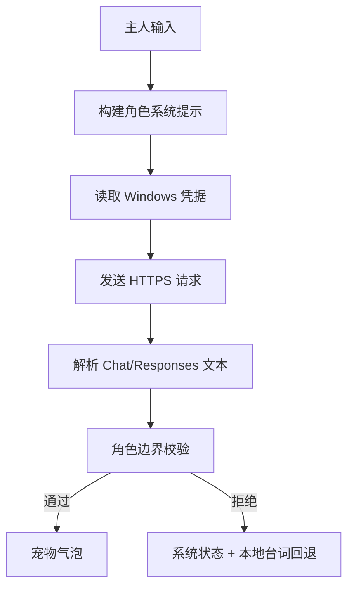
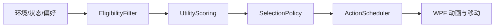

# Pupu Desktop 1.3.0 代码实现设计说明

## 1. 架构范围

解决方案分为三个项目：

| 项目 | 职责 |
|---|---|
| `Pupu.Behavior` | 平台无关的性格、状态、行为选择、互动会话、感知、记忆和宠物台词约束 |
| `Pupu.Desktop` | WPF 界面、动画、Win32 窗口/显示器感知、模型 API、凭据存储和持久化接线 |
| `Pupu.Tests` | 无第三方测试框架的确定性验收与轨迹回放 |

行为层不依赖 WPF，桌面项目把操作系统信号转换为行为上下文。UI 不直接决定自主行为。

## 2. 宠物发言边界

### 2.1 `PetSpeechComposer`

文件：`Pupu.Behavior/PetSpeech.cs`

`PetSpeechIntent` 描述发言意图，如启动、轻触享受、好奇、边界、回避、进食、玩耍、休息、记住、主动关注、对话和可恢复问题。

`Compose` 根据：

- `TemperamentBaseline`；
- `RuntimeState.Stress`；
- 发言意图；
- 可选外部草稿；

选择角色台词。外部草稿只有通过 `TryNormalizePetReply` 才能进入气泡，否则使用本地台词。

`TryNormalizePetReply` 完成：

- 空白归一；
- 技术词正则拦截；
- “作为 AI”等身份泄漏清除；
- 120 字符上限；
- 空结果拒绝。

`BuildSystemPrompt` 把身份、五维性格、当前状态、关系、自主性、关心边界和技术禁区组合为模型系统提示。该方法只用于模型请求，不向宠物气泡显示。

### 2.2 UI 分层

`MainViewModel.ShowBubbleAsync` 是宠物气泡的单一入口，再次调用 `PetSpeechComposer`。启动失败、模型失败、素材失败和规则保存失败把详细文本写入 `MemoryStatus`、`ModelApiStatus` 或 `AssetPackStatus`。

`App.xaml.cs` 的不可恢复异常对话框标题和正文明确标记为“系统诊断（不是宠物发言）”。

## 3. 模型 API

### 3.1 数据模型

`ModelApiSettings` 保存：

- `Enabled`；
- `Endpoint`；
- `Model`；
- `Temperature`；
- `MaximumReplyTokens`。

`StoragePaths.ModelApiSettingsFile` 指向 `%LOCALAPPDATA%\PupuDesktop\model-api.json`。该文件不包含 API 密钥。

### 3.2 `ModelApiService`

文件：`Pupu.Desktop/Services/ModelApiService.cs`

主要流程：

Endpoint 包含 `/responses` 时发送 `instructions` 与 `input`；否则发送 Chat Completions 的 `messages`。响应可解析：

- `choices[0].message.content`；
- `output_text`；
- `output[].content[].text`。

远程 endpoint 必须为 HTTPS；环回地址允许 HTTP。HttpClient 超时为 45 秒。非成功状态码、无文字、越界回复都抛出只供系统状态区使用的异常。

### 3.3 凭据

`WindowsCredentialVault` 使用 `CredWrite`、`CredRead`、`CredDelete`：

- 类型：Generic Credential；
- target：`PupuDesktop/ModelApi`；
- 持久化：当前 Windows 设备；
- 读取后的原生指针由 `CredFree` 释放；
- 写入临时字节与非托管内存在结束时覆盖并释放。

旧 `ChatGptWebBridgeService` 已删除，菜单、命令和 XAML 不再提供打开 ChatGPT 或复制粘贴网页回复。

## 4. 双击与互动会话

`MainWindow.xaml.cs` 不再根据 `ClickCount >= 2` 打开控制面板。每次鼠标释放都进入同一触摸解释路径。

`GestureInterpreter` 用时间、位移、持续时间和区域解释：

- touch；
- stroke；
- hold；
- drag；
- rapid_tap；
- release。

`InteractionSessionManager` 在会话窗口内合并连续触摸。双击生成两次触摸事件，但只形成一个连续会话与一个学习机会。达到频率阈值后才是 `rapid_tap`；是否享受、警告或回避仍由性格、关系和状态决定。

控制面板只由右键命令触发，消除“连续互动还是打开面板”的输入竞争。

`GestureInterpreter` 的近期队列同时保存时间与手势类型，只保留最近 6 秒。`MainViewModel.ProcessGestureEventsAsync` 由当前队列计算：

- `petting_load`：连续触摸负担；
- `boundary_pressure`：进入移开视线或转身边界的压力；
- `escape_pressure`：持续越界后离开的压力。

`touch.warning`、`touch.avoid`、`touch.run_away` 分别带有 `0.25`、`0.62`、`0.92` 的硬前置信号。第一次触摸三个信号均不达门槛，因此不能直接炸毛或跑开；安静 6 秒后旧负担不再参与下一次互动。

## 5. 窗口和显示器感知

### 5.1 `EnvironmentContextService`

文件：`Pupu.Desktop/Services/EnvironmentContextService.cs`

Win32 输入：

- `EnumWindows`；
- `IsWindowVisible`；
- `IsIconic`；
- `GetWindowRect`；
- `GetForegroundWindow`；
- `GetWindowThreadProcessId`；
- `MonitorFromWindow`；
- `GetMonitorInfo`；
- `GetDpiForWindow` / `GetDpiForMonitor`；
- `EnumDisplayMonitors`。

过滤规则：

- 排除宠物自身窗口；
- 排除不可见、最小化、工具窗口；
- 排除没有普通标题或尺寸过小的窗口；
- 排除过度贴近显示器顶边、无法安全站立的表面；
- 不读取窗口内容。

输出类型：

- `DesktopRect`；
- `WindowSurfaceSnapshot`；
- `DesktopEnvironmentSnapshot`。

候选评分优先：

1. 与宠物同一显示器；
2. 常见浏览器进程；
3. 当前前台窗口；
4. 足够宽的安全上沿；
5. 合理的垂直位置。

这只是感知候选优先级。行为能否执行仍由 EligibilityFilter 的 `window_edge_available` 硬条件决定。

### 5.2 坐标与 DPI

Win32 返回物理像素，WPF 使用 DIP。服务按窗口或监视器 DPI 把边界转换为 DIP。所有自动移动通过 `CurrentWorkArea()` 获取宠物当前监视器工作区，而不是全局 `SystemParameters.WorkArea` 主屏值；后者只保留为窗口句柄尚未创建时的启动回退。

### 5.3 窗口跟随

`MainWindow` 每两秒捕获环境：

- 把快照传给 `MainViewModel`；
- 若正在栖息，按窗口句柄刷新表面；
- 窗口移动或缩放后更新宠物 X/Y；
- 目标消失、最小化或变得不安全时解除跟踪；
- 主人开始拖动宠物时立即解除窗口吸附。

`WindowPerch` 使用平滑三次曲线移动到窗口上沿；`WindowEdgeWalk` 在有效左右范围内选择目标并循环移动。每段移动约 60 FPS 插值，不直接跳坐标。

显示器、系统时间、休眠和唤醒事件会刷新上下文与状态恢复。

## 6. 行为管线接线

`BehaviorCatalog` 新增：

- `idle.sploot`；
- `environment.window_edge_rest`；
- `environment.window_edge_walk`。

窗口行为要求 `window_edge_available >= 0.2`。浏览器信号只提高效用，不替代硬前置。

运行流程：

`MainViewModel.UpdateDesktopEnvironment` 把快照转换为有 TTL 的 `PerceptionEvent`，设置 `window_edge_available` 和 `browser_edge` 信号。`RunWindowSurfaceBehaviorAsync` 发起桌面移动请求；成功后记录动作生命周期和状态效果。

板鸭趴是被动低干扰自主候选，受疲劳、压力、独立度、活泼度、冷却和重复抑制影响。

## 7. 动画与素材

### 7.1 正式图集

清单：`Pupu.Desktop/Assets/pupu-assets.json`

1.3.0 正式引用：

| ID | 文件 | 网格 | 版本用途 |
|---|---|---:|---|
| `core` | `pupu-core-youthful-v9.png` | 8×6 | 圆脸趴卧、逗猫棒、困倦哈欠及兼容动作 |
| `life` | `pupu-life-youthful-v6.png` | 8×8 | 生活互动 |
| `directions` | `pupu-directions-youthful-v9.png` | 8×4 | 闭合四向步态 |
| `touch` | `pupu-touch-youthful-v9.png` | 8×6 | 轻触到信任/离开的完整关系动作 |
| `routines` | `pupu-routines-youthful-v6.png` | 8×8 | 日常待机与进食 |
| `walkModes` | `pupu-walk-modes-youthful-v9.png` | 8×8 | 高清孔雀蓝背带与自由步态 |
| `activity` | `pupu-activity-youthful-v8.png` | 8×8 | 激光、睡眠、板鸭趴和窗口上沿 |

每格为 256×256 RGBA。项目文件只发布清单引用的图集；旧 V6 核心/触摸/方向/行走与 V7 Activity 移入 `AssetSources/legacy-formal`，不进入运行目录。

### 7.2 V9 生成流程

`scripts/rebuild-v9-assets.sh`：

1. 使用两张高清面部照作为主要身份约束，生成触摸、核心与四方向行走色键源；
2. 用图像生成技能形成圆脸、短口鼻、常态圆眼和清晰孔雀蓝背带；
3. 去除绿色背景、柔化 alpha 边缘并去除绿溢色；
4. V9 触摸源按真实行结构 `7,7,7,8,8,8` 提取完整连通主体，防止相邻猫合并；
5. 触摸姿势分别适配 216px 舞台；移动行按统一比例与底部锚点归一化；
6. 移动关键帧组成 `0,1,2,3,4,3,2,1` 闭合半步往返序列；
7. 左向行镜像生成右向行；自由方向图由行走模式的无背带行同步生成；
8. 以临时 staged 文件完成尺寸、解码和 alpha 检查后原子替换正式图集。

`MainViewModel.PlayMovementSequence` 在方向序列之间保留 `_framePosition / previousLength` 的归一化相位，再映射到新序列，从而避免转向时落脚节奏回到第 0 帧。

### 7.3 质量审计

`scripts/verify-assets.sh` 检查：

- 清单 JSON；
- 七张图集尺寸；
- 384 格非空；
- alpha 主体最大 216px；
- 四边最少 20px；
- PNG 重复完整解码。

`scripts/audit-asset-quality.py` 额外使用 Pillow/Numpy 检查：

- 有效主体短边 ≥64px；
- 有效主体长边 ≥96px；
- 主体区域 Laplacian 方差 ≥70；
- 移动行表观包围盒面积最大/最小值 ≤1.25；
- 相邻帧（包含循环尾首）主体中心欧氏位移 ≤10px；
- 所有清单图集逐格覆盖。

本版实测：有效主体至少 `69×101px`，最低清晰度 `111.3`，移动体型漂移最大 `1.214×`，相邻帧中心位移最大 `9.01px`。Windows 构建同时运行 PowerShell 版尺寸验证。

## 8. 面板

`ControlWindow.xaml` 把对话页改为“和朴朴聊天”：

- 启用复选框；
- endpoint；
- 模型名；
- PasswordBox；
- 温度；
- 保存、测试、删除密钥；
- 独立系统状态；
- 对话列表和输入框。

技术信息使用小号系统说明样式；宠物对话内容与系统状态不共用绑定。面板保持低饱和青灰与暖橙卡片体系。

`MainWindow.xaml` 的宠物气泡取消固定 `286×74` 尺寸，改为 `MinWidth=112`、`MaxWidth=320`、`MinHeight=38`，文字最大宽度 286 并自动换行。窗口继续保留动画布局空间，气泡隐藏或短句变化不会推动宠物跳位。

## 9. 持久化

| 数据 | 位置 | 敏感性 |
|---|---|---|
| 模型非敏感设置 | `%LOCALAPPDATA%\PupuDesktop\model-api.json` | 不含密钥 |
| 模型 API 密钥 | Windows 凭据管理器 | 敏感 |
| 行为/关系/状态 | `personality-behavior-v2.json` | 本地 |
| 可编辑记忆 | `pupu-memory.md` | 本地 |
| 事件时间线 | `events.md` | 本地 |
| 错误日志 | `pupu-error.log` | 不写 API 密钥 |

模型 API 失败不会修改记忆或天生性格。

## 10. 测试

`Pupu.Tests/Program.cs` 共 30 项。1.3.0 新增：

- 第一次触摸时 `touch.warning`、`touch.avoid`、`touch.run_away` 均被硬前置拒绝；
- 连续触摸会积累负担，安静超过窗口后旧负担清空。

原 28 项继续覆盖：

- 双击仍是连续触摸且不映射面板；
- 宠物台词屏蔽技术语言，并随性格变化；
- 窗口上沿行为在缺少操作系统表面信号时被 EligibilityFilter 拒绝；
- 五维性格分布；
- 状态压制；
- 固定种子选择；
- 24 小时切换稳定性；
- 感知习惯化；
- 休眠/唤醒/系统时间/显示器轨迹；
- 同一连续触摸会话；
- 无回应不降信任；
- 记忆删除级联；
- 确认事实优先；
- 动态互动区域；
- 长动作中断；
- 迁移幂等；
- 离线无欠账。

发布验证还包含 WPF 编译、XAML 绑定静态检查、384 格素材审计、ZIP 完整解压、PE 类型和发布/源码素材哈希一致性。

## 11. 运行风险与后续建议

- Win32 窗口枚举、混合 DPI 与虚拟桌面坐标必须在 Windows 10/11 多显示器设备实测；
- 可增加按窗口类别学习“喜欢趴在哪里”，但不得读取内容；
- 模型 API 可后续增加更多兼容响应适配器，仍需经过同一角色边界；
- 生活和日常图集仍为 V6；后续重绘时应继续使用 V9 的圆脸身份参考、逐行真实帧提取和清晰度审计，不允许为了统一而直接放大低清旧素材。
