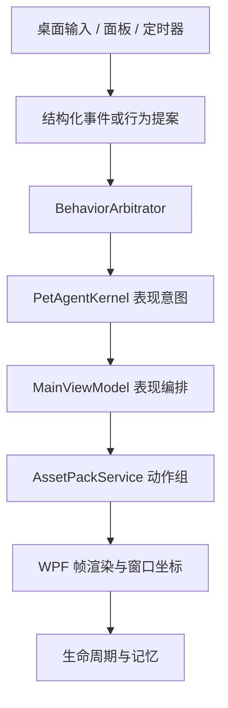
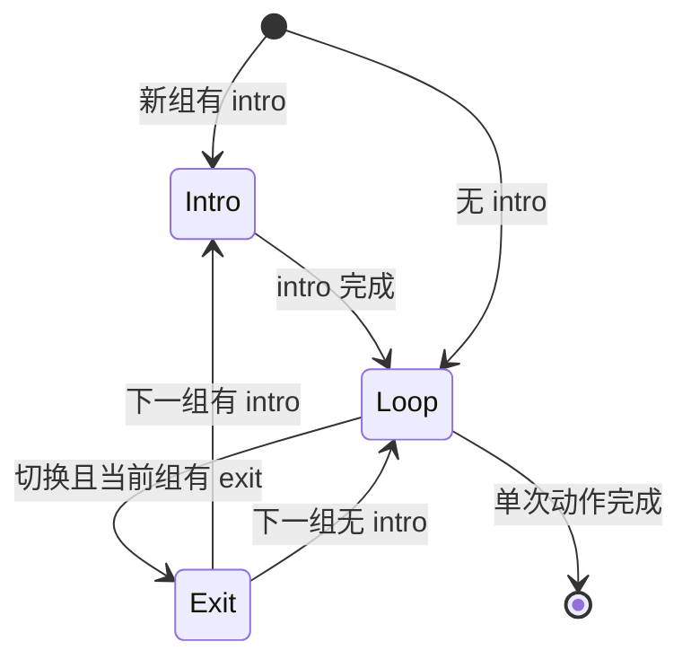

# Pupu 1.11.3 / V19 开发者技术说明

本文面向继续维护 Pupu 的开发者，说明 V19 素材、动作播放器、对话、银币、魔法／节日和发布门禁。运行时真源是 `Pupu.Desktop/Assets/pupu-assets.json`，本文不替代代码和清单。

## 1. 总体链路



`BehaviorArbitrator` 是行为资格、优先级、保护期、可打断性、冷却与硬状态的唯一入口。LLM 只能生成回复文本；它不能直接播放动画、移动窗口、修改关系或写入长期记忆。

## 2. 工程模块

| 模块 | 责任 | 禁止事项 |
| --- | --- | --- |
| `Pupu.Behavior` | 行为定义、评分、仲裁、运行状态、关系与偏好 | 依赖 WPF、Windows API、模型服务或 PNG |
| `Pupu.Application` | 用例、提案执行、平台端口、素材契约、表现意图 | 直接操作窗口、文件选择或凭据 |
| `Pupu.Platform.Windows` | Windows 凭据、环境探测等平台实现 | 把 Win32 类型泄漏到核心层 |
| `Pupu.Desktop` | WPF 组合、输入、图集解析、动画与坐标表现 | 绕过仲裁器直接创建业务状态 |
| `Pupu.Installer` | 校验载荷、当前用户安装、升级与回滚 | 修改用户记忆目录 |

## 3. V19 素材真源与运行输出

V19 不再加载旧运行图并“只覆盖几行”。重建脚本直接读取：

- 九张 `AssetSources/v18/*-chroma.png` 身份母表；
- `AssetSources/v19/pupu-magic-v19-chroma.png`；
- `AssetSources/v19/pupu-seasonal-v19-chroma.png`；
- `AssetSources/v19/pupu-broom-flight-8dir-v19-chroma.png` 八方向飞行身份源；
- `AssetSources/v19/pupu-cage-rest-v19-chroma.png` 闭门笼中休息源；
- V17 正视银币母版和 V16 归档背面，仅作为稳定生成源。

所有包含猫咪的正式图集和条带都输出为 `*-v19.png`。冻干块与激光点是无猫目标物，保持独立文件和行为能力声明。

### 3.1 身份契约

- 银灰黑白长毛拿破仑矮脚猫；
- 圆幼脸、短口鼻、黄绿色圆眼、粉黑鼻；
- 自然偏长躯干、明显短腿、完整大尾巴；
- 256×256 RGBA 单格，四边至少 20px 透明安全区；
- 道具、斗篷、帽子和猫窝不得改变猫本体比例。

### 3.2 4 姿态扩为 8 相位

V19 的 8 相位不是把 `0-1-2-3` 复制两次，也不是两张整猫交叉淡化。每个关键姿态后增加一个受控微相位：呼吸、脚掌负重、尾尖或 1px 内重心变化。约束如下：

1. 相邻帧像素不得完全相同；
2. 不允许出现双重曝光或两只重叠猫；
3. 保持同一脚底线和主体尺度；
4. 循环末端必须自然回到首帧；
5. 单次动作末帧允许稳定停住。

冻干、激光与扫帚飞行条带均为 `8 directions × 8 phases = 64 frames`。运行时通过 `directionIndex * 8` 选取对应连续八帧，不再使用四相或“每方向一张静止图”的硬编码。扫帚的召唤／上扫帚仍在 `specials:1` intro 中，巡航只读取独立飞行条带；换向保留归一化相位。

## 4. 动作组与过渡状态机



`AssetPackService.ResolveActionGroup()` 返回完整的 `GroupId`、`BehaviorId`、`LoopMode`、`IntroFrames`、`LoopFrames`、`ExitFrames` 和 `CompatiblePostures`。播放器规则：

- 同组重入不重复播放退出段；
- 非移动动作切换时，若当前有 `exit` 且姿态不兼容，先播放退出段；
- 下一组有 `intro` 时先播放入场，再进入 `loop`；
- 移动方向变化保持归一化播放相位，避免每次回到第 0 帧；
- 单次动作没有后继片段时停在末帧；
- 睡姿的专用平滑转换仍保留。

动作组元数据在“素材库 → 技术与存储”显示来源、行为 ID、帧数、基准时长、循环类型、I/L/E 数量、fallback 和校验结果。

## 5. 素材到真实行为

只存在于素材库预览不算完成。每个新动作至少同时注册：

1. `pupu-assets.json` 动作组；
2. `BehaviorCatalog` 行为定义；
3. `BuildPresentationResolver()` 表现映射；
4. 素材库分类与说明；
5. 触发条件／参与规则；
6. 回归测试。

V19 的 `social.ask_walk` 已按上述路径接通，使用 `lifeEquipment:2` 的叼绳图，不再别名为 `social.respond_call`。`rest.bed` 使用 `lifeEquipment:1` 的 V19 蓝色长方形猫窝。

## 6. 本地素材包升级规则

应用先加载内置清单。`%LOCALAPPDATA%\PupuDesktop\assets` 的自定义清单只有在 `version` 与内置版完全一致时才可覆盖。历史版本会显示警告并使用内置 V19。

“打开可编辑素材目录”行为：

- 版本一致：保留用户已编辑的当前版文件；
- 版本不同或清单损坏：覆盖清单和本版全部引用 PNG；
- 未被当前清单引用的旧文件不参与运行。

这避免了安装目录已升级、用户目录仍把旧猫窝或旧动作重新覆盖的情况。

## 7. 对话入口与模型联调

桌面窗口在宠物下方保留 26px 无文案空白区；只有双击才显示输入栏并把键盘焦点放入文本框，因此不会与宠物单击、触摸、拖动或右键菜单冲突。面板“大模型 → 对话联调”使用完全相同的：

- `ChatInput` / `ChatMessages`；
- Persona 和主人档案；
- 短期会话与脱敏长期记忆；
- 模型供应商、Endpoint 和 Windows 凭据；
- 失败后的本地 RulePetAgent 回退。

模型未启用、密钥不存在或网络失败时，行为与本地回复仍应工作。调试页显示 `ModelApiStatus` 和 `LlmFallbackReason`。

## 8. 银币状态与手势

| 状态 | 视觉 | 输入 |
| --- | --- | --- |
| `normalColor` / `unhappyColor` | 高饱和亮银、增强对比与斜向高光 | 单击恢复到亮彩状态 |
| `normalFaded` / `unhappyFaded` | 低光泽冷银，保留头像色彩，无明显锈迹 | 时间推进后进入 |
| `normalEdge` / `backEdge` | 正面／背面的真实窄侧缘 | 双击翻转中途自动经过 |
| `back` | 同圆心猫爪浮雕背面 | 双击翻转 |

拖拽优先级高于单击与双击。指针移动超过阈值后只移动窗口，不产生刷新或翻面动作。双击在第二次按下时即被识别，释放事件不会再误触单击刷新；翻面按“正面压缩 → 正面侧缘 → 背面侧缘 → 背面展开”执行。石化银币不受普通触摸手势影响。

## 9. 魔法与节日

V19 魔法四行：Accio Broom、Apparate、Petrificus Totalus、Scourgify。V19 节日四行：圣诞、万圣节、春节、主人生日。它们共用 V18/V19 身份比例，服饰仅作覆盖。

主人菜单明确触发的魔法使用 `OwnerForced`，可打断普通行为；笼中、旅行中和已石化等硬状态仍阻止不兼容魔法。自主魔法保留每日次数、冷却与资格评分。Petrificus 先播放从肉身到石质的渐变，再保持完整石像约 1.85 秒，最后才切换亮银币。节日素材只在精确日期触发，预览不能绕过日期门禁。

## 10. 数据与隐私

| 数据 | 默认位置／边界 |
| --- | --- |
| 状态、关系、偏好 | `%LOCALAPPDATA%\PupuDesktop` 下的本地 JSON |
| 主人可读记忆 | `pupu-memory.md` / `events.md` |
| 短期对话 | 本地轮数受限会话 |
| API Key | Windows 凭据管理器，不写 JSON |
| 相册 | 仅保存链接和相对索引，不复制原图 |

发给模型的上下文移除绝对路径，只包含有限相关摘要；图片需要显式授权并受数量限制。

## 11. 验证与发布

本地可运行：

```bash
python scripts/rebuild-v19-assets.py
python scripts/audit-asset-quality.py
bash scripts/verify-assets.sh
bash scripts/verify-bindings.sh
bash scripts/verify-architecture.sh
```

Windows CI 还必须完成：Release 编译、测试运行器、WPF XAML 编译、自包含发布、安装器载荷校验和产物上传。产品版本只由 `Directory.Build.props` 的 `PupuVersion` 提供，构建脚本、安装器程序集和 CI 产物名不得再次硬编码；当前安装器名称为 `Pupu-Setup-x64-1.11.3.exe`。

完整 CI 由三个互不依赖的分支并行运行：快速编译与测试、素材清单与逐帧审计、Windows 发布与安装器试构建。最后的汇总门禁报告三个分支的独立结果，因此一项失败不会遮住其他层的问题。`windows-quick-preflight.yml` 还支持手动运行，用于正式打包前快速检查 Release 编译、架构、WPF 绑定、素材清单和确定性测试。

`pupu-assets.json` 是正式运行 PNG 的唯一文件名来源。`Pupu.Desktop.csproj` 只保留通配复制规则；`verify-asset-manifest.ps1` 在源码阶段要求“Assets 运行 PNG = 清单引用”，并在 publish 后再次要求“发布 PNG = 清单引用”。新增动作素材不再需要同步维护第二份逐文件工程清单。

发布门禁重点：

- 所有清单 PNG 完整解码；
- 无绿色外缘，安全边距与主体尺度合格；
- V19 猫咪运行文件不引用旧版本；
- 两个追逐动作均为 64 帧、每方向 8 相位；
- `social.ask_walk` 存在于行为目录且映射一致；
- 桌面对话入口、面板对话、银币三种手势通过实机检查；
- Windows 混合 DPI、多屏、凭据与 SmartScreen 只能在实机最终验收。
